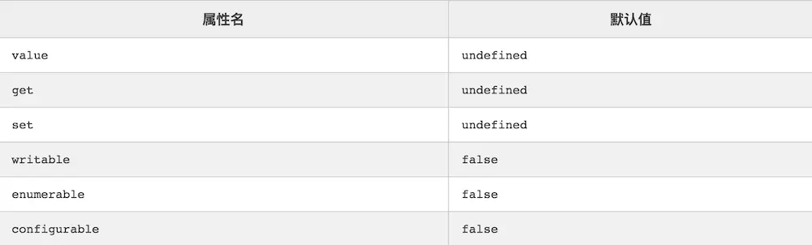

# ES6

#### ES6常用语法

* let和const命令

   **let和var的区别**

   0）注意区分全局作用域，函数作用域和块级作用域(除函数外，其他{}包括的区域，例如for、if等)

   1）var声明的是全局变量，*let命令只在所在的代码块内有效*

   2）var存在变量提升(undefined)，let不存在变量提升(报错)，***变量提升带来的函数作用域内同一变量覆盖情况注意一下***

   3) for循环计数器中注意var计数器和let计数器最终赋值的问题,var在当前循环作用域内不能再赋值,let在当前作用域内可再赋值，分为父子作用域

   4）只要块级作用域内存在let命令，它所声明的变量就绑定在这个区域，不再受外部的影响

   5）块级作用域可以替代立即执行函数，不会存在变量覆盖或者变量泄漏等问题

   6）const保证并不是变量的值不得改动，而是变量指向的那个内存地址所保存的数据不得改动，简单类型(数值，字符串，布尔值)内存地址保存的数据就是赋的值，复合类型(对象和数组)内存地址保存的数据是指向实际数据的指针(指向真实数据地址)

   7）ES5只有两种声明变量的方法：var和funciton ES6有6种声明变量的方法：let,const,var,function,import,class


* 字符串扩展
 
   ```
    s1.startsWith(s2)   // 字符串s1是否以字符串s2开头    return boolean
    s1.endsWith(s2)     // 字符串s1是否以字符串s2结尾    return boolean
    s1.includes(s2)     // 字符串s1是否包含字符串s2      return boolean

   ```

* 函数扩展

   **rest参数**

   1) rest参数是一个真正的数组，数组特有的方法都可以使用，arguments对象是一个类数组，需要通过Array.prototype.slice.call(arguments)转为数组

   **箭头函数(=>)**

   1) 函数体内的this对象就是定义时所在的对象，而不是使用时所在的对象，注意function和()=>{}的区别和组合使用

   2）不可以当作构造函数，不可以使用new命令

   3）不能使用arguments对象，不能使用yield命令，最好不要在小程序中使用

   **尾调用和尾递归**

* 数组扩展

   **Array.from 和 Array.of**

* 对象扩展

   **属性的简洁表示法**
   
    ```
    module.exports = { getItem, setItem, clear };
    // 等同于
    module.exports = {
        getItem: getItem,
        setItem: setItem,
        clear: clear
    };

    const o = {
        method() {
            return "Hello!";
        }
    };
    // 等同于
    const o = {
        method: function() {
            return "Hello!";
        }
    };

    ```

* Symbol,Set和Map类型

   1）Symbol是js的第七种数据类型，为了解决对象key只能是字符串导致冲突问题，需要通过Symbol()或者仅带字符串参数创建

   2）Set是一个类数组结构，只能存储不重复的值，通过new Set()或带数组(或具有iterable接口的其他数据结构)参数创建

   3）Map是一种类对象结构，重复键会覆盖前面的，突破普通对象的键只能是字符串的限制，各种类型值(包括对象)都可以当作键，Object 结构提供了“字符串—值”的对应，Map 结构提供了“值—值”的对应

* Proxy构造函数

   1) new Proxy(target, handler), handle为 {},用来定制拦截行为; target 表示所要拦截的目标对象

   2) handle对象中, 对于每一个被代理对象的操作，需要提供一个处理函数，该函数将拦截对应的操作

   3）handler中的处理函数
   > get: function(target, propKey, receiver) 简写为 get(target, propKey, receiver) // 拦截对象属性的读取 如proxy.propKey其中proxy为Proxy实例对象, 参数: target为Proxy传递下来的代理对象, propKey为访问属性,receiver为当前实力对象

   ```
    const dom = new Proxy({}, {
        get: function(target, property) {
            return function(attrs = {}, ...children) {
                const el = document.createElement(property);
                for (let prop of Object.keys(attrs)) {
                    el.setAttribute(prop, attrs[prop])
                }
                for (let child of children) {
                    if (typeof child === 'string') {
                        child = document.createTextNode(child)
                    }
                    el.appendChild(child)
                }
                return el
            }
        }
    })
    const el = dom.div({}, 'Hello, My name is ', dom.a({'herf': 'https://www.baidu.com'}, 'Mark'), '. I like:', dom.ul({}, dom.li({}, 'The Web'), dom.li({}, 'JAVA')))
    document.body.appendChild(el)
   ```
   
   > set:(target, propKey, value, receiver)：拦截对象属性的设置，比如proxy.foo = v或proxy['foo'] = v，// 返回一个布尔值  参数: value为要设置的值

   > **apply(target, ctx, args)** 拦截 Proxy 实例作为函数调用的操作即函数的调用，apply和call操作，比如proxy(...args)、proxy.call(object, ...args)、proxy.apply(...)。// 参数: target为目标对象, ctx为目标对象的上下文对象(this), args为目标对象的参数数组


#### JS运行原理 event-loop
#### 浏览器原理


#### 聊聊Object 

* Object.create()和 new Object()的区别

   ```
     Object.myCreate = function (obj, properties)  {
        var F = function ()  {}
        F.prototype = obj
        if (properties) {
            Object.defineProperties(F, properties)
        }
        return new F()
    }


   ```

   Object.create(obj,[properties]) 本质返回的是一个实例对象，
   

* Object.defineProperty

**基本用法** Object.defineProperty(obj, prop, desc)

**JS的三种类型属性**

   1. 命名数据属性：拥有一个确定的至的属性。这是最常见的

   2. 命名访问器属性：通过getter和setter进行读取和赋值的属性

   3. 内部属性：游JS引擎内部使用的属性，比如_proto_属性

**desc对象属性**



数据描述符：value,writable,configurable,enumerable

存取描述符：get和set

