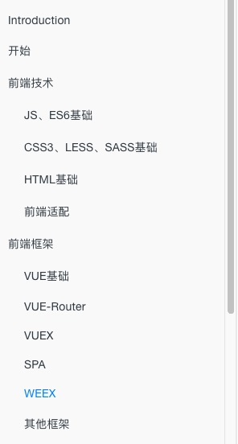
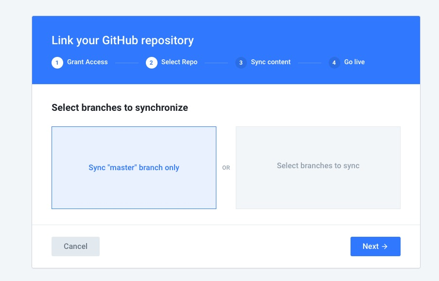

# GitBook

### 1. GitBook简介

首先要区分Git、Github和GitBook，三者之间是什么样的关系，GitBook使用Git和markdown来编排书籍，GitBook和Github没有直接的关系，不过用户可以手动添加GitBook和Github的关联(inteGration)，通过修改Github上的markdown文件，实现GitBook实时更新

**Git**

Git可能是目前全球最通用软件编程、软件开发项目的管理工具，帮助开发人员对项目文件和开发进度进行管理，支持版本历史管理和多人协作管理等必须功能。

**GitHub**

GitHub是Git在线化，就是有人把自家的Git服务向所有人公开了，每个开发者都能使用它来在线管理自家的项目。目前它已经是全球最大的开源软件项目集散地地，很多知名的项目比如Nodejs，Tensorflow等等都是发布在GitHub上面的开源项目。

**GitBook**

GitHub是基于Git技术的，是面向做软件开发的程序员的。GitBook同样是基于Git技术的，但它最初定位是面向软件说明文档的编写者的，但它同样适合任何类型的文字编辑工作者。

### 2. GitBook安装

GitBook是基于Node的命令行工具，使用前需要安装Node.js

* GitBook使用npm安装，命令行如下:

```
npm install gitBook-cli -g

```

* 检测是否安装成功:

```
$ gitBook -V(此处要大写)
CLI version: 2.3.2
GitBook version: 3.2.3

```

* 本地创建GitBook工程

```
	$ mkdir mypro //创建文件目录mypro
	$ cd mypro 
	$ gitbook init //初始化项目

```

	gitbook init 后mypro文件夹中会自动创建README.md和SUMMAY.md两个文件。
	README.md    是对本书籍的简单介绍
	SUMMARY.md.  是书籍的目录结构(用户可通过markdown编写添加内容，最多支持二级目录，默认)
	
SUMMARY.md示例:

```
# Summary

* [Introduction](README.md)
* [开始](start.md)
* [前端技术](fontend/es6.md)
    * [JS、ES6基础](fontend/es6.md)
    * [CSS3、LESS、SASS基础](fontend/css3.md)
    * [HTML基础](fontend/html.md)
    * [前端适配](fontend/adapter.md)
* [前端框架](vue/index.md)
    * [VUE基础](vue/index.md)
    * [VUE-Router](vue/router.md)
    * [VUEX](vue/vuex.md)
    * [SPA](vue/spa.md)
    * [WEEX](vue/weex.md)
    * [其他框架](vue/react.md)
```
生成书籍后的目录如图所示：

 

> 注意：编写完SUMMARY.md后再次执行gitbook init命令，gitbook会根据目录内容自动创建文件夹和文件

> introduction菜单项指向README，默认无法替换和删除

* 本地预览

```
$ gitbook serve

```
然后浏览器打开 [http://localhost:4000](http://localhost:4000) 就能预览了，control + c 停止。

* 输出静态网站(html)

```
$ gitbook build

```
gitbook serve和gitbook build 命令都会在书籍目录生成 _book，前者能实时预览

输出静态网站就可部署到web服务器上，或者通过在阿里云或者腾讯云购买域名，网页服务挂载在GitHub Page上供互联网用户访问

### 3. book.json详解

### 4. GitBook与GitHub建立关联(integration)

1）进入GitBook官网注册，登录  [GitBook官网：https://www.gitbook.com/](https://www.gitbook.com/)

2）使用默认账户，或者创建新的ORGANIZATIONS，如图所示


3）选中账户或者组织，按照向导创建space(免费用户可创建两个space,但只有一个是public的)，如图所示


4) 创建完space后, 点击红框部分菜单，选择integrations，进行GitBook与其他工具的关联


5）选择GitHub按照向导，完成即可实现GitHub和GitBook的关联，本人选择在GitHub编写，GitBook实时更新



6) 完成绑定后，用户本地编写md文件，然后通过Git上传到GitHub上，GitBook就会自动更新