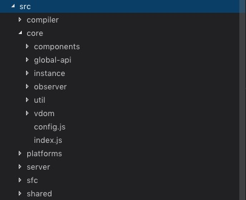

# 前端框架(Vue)

### 使用指南

   1 集成webpack

   npm i -D vue  vue-loader vue-template-compiler(编译template标签需要)

   webpack 配置文件module中增加配置项

   ```
    module:{
        rules:[
            ...
            {
            test: /\.vue$/,
            loader: "vue-loader"
            },
            ...
        ]
    },
    // 默认加载vue.js 可通过配置resolve设置加载源
    resolve: {
        extensions: ['.js', '.vue'],
        alias: {
            'vue': 'vue/dist/vue.esm.js',
        }
    },

   ```

   2 项目结构

   * 每个页面入口是一个JS，JS中有且仅有一个new Vue({options}) 实例，
       
   * JS对Vue实例进行如下操作
         
     1）import vue和 组件(第三方库或者自定义组件)
         
     2）通过Vue.use()全局注册第三方库(其实是作为插件install，在new Vue()之前调用)，通过配置options注册自定义组件

    ```
    import Vue from 'vue'
    import app from '../component/index.vue'
    import VueRouter from 'vue-router'
    import Vuex from 'vuex'

    Vue.use(Vuex)
    Vue.use(VueRouter)

    //index.html页面中没有写<app>标签
    new Vue({
        el: '#container',
        template: "<app/>",
        components: {app}
    })

    /*
    //index.html页面中写<app>标签的
    new Vue({
        el: '#container',
        components: {app}
    })
    */

    ```
    
   * 自定义组件(.vue文件)

        1) 自定义组件只能有一个```<template>```根标签,

        2) ```<style scoped>``` 定义组件私有样式 ```</style>```

        3) <script></script> 定义组件行为，组件行为最终输出为一个对象：export default {}

   ```
    <template>
      <div class = "count">{{counter}}</div>
    </template>
    <script>
      export default {
        data(){
            return {
                counter: 4
            }
        }
      }
    </script>
    <style scoped>
        .count {
            color: #00f
        }
    </style>

   ```

3 常用语法

4 开发插件

5 源码分析

   1). 通过vue源码目录结构
   
    
   
   可以看出VUE源码分为:Compiler编译，Core(组件，全局API，实例，数据绑定，虚拟节点)，跨平台实现等

   vm ······················ 实例

   _data, _props ··········· 源码内部定义的属性，用于存储data,props等用户数据


   render函数简写:

    Vue.prototype._o = markOnce
    Vue.prototype._n = toNumber
    Vue.prototype._s = _toString
    Vue.prototype._l = renderList
    Vue.prototype._t = renderSlot
    Vue.prototype._q = looseEqual
    Vue.prototype._i = looseIndexOf
    Vue.prototype._m = renderStatic
    Vue.prototype._f = resolveFilter
    Vue.prototype._k = checkKeyCodes
    Vue.prototype._b = bindObjectProps
    Vue.prototype._v = createTextVNode
    Vue.prototype._e = createEmptyVNode
    Vue.prototype._u = resolveScopedSlots
 
  2) 双向数据绑定

    核心概念是：Object.defineProperty(), 发布者(Dep)和 订阅者 (Watcher), 

   * 首先通过 new Observer(data) 将data转为可观察的对象
    
   * Dep负责收集依赖，通过遍历data中的每个属性，为每个属性创建一个Dep，当通过this.data.** 时，说明该属性被应用了会被defineProperty中的get方法拦截，此时会通过dep进行依赖收集

   * 每个收集依赖数据(属性)的dep对象都会存储一个操作此属性的watcher，用于set修改时，调用watcher中的update和run方法，进行虚拟dom树对比和视图更新


    源码解析经过：

    |  执行顺序 | 文件路径 | 执行脚本  |
    | :-----:  | :-----: | :-----:|
    |     1    | core/instance/index.js | new Vue(options) |
