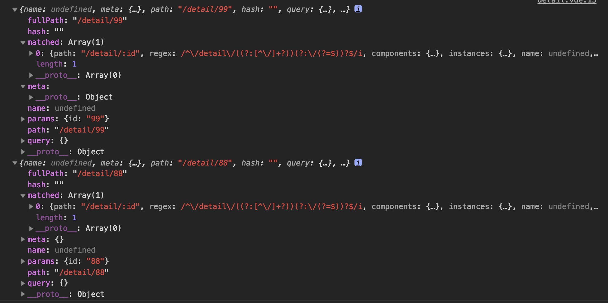

# VUE-Router

### 使用指南

   1）Vue要全局引用VueRouter插件, VueRouter本身就是一个对象，需要通过new实例化
   
   2）实例中要同时挂载 new VueRouter({})实例

   ```
   import Vue from 'vue'
   import VueRouter from 'vue-router'

   Vue.use(VueRouter)

   const router = new VueRouter({
       routes: [
           {path:'', component: 组件},{}...
       ]
   })

   new Vue({
       el: '',
       router,
       component: '根组件'
       template: "</跟组件>"
   })

   ```

   3）单页应用只有一个VueRouter实例，实例初始化全局的路由定义

   4）router-view 是 routes中定义的path对应的component的代词，实际渲染中会被component组件的渲染视图替换掉

   5）router-link 最后会被渲染为```<a>```标签中 存在与模版组件中， **切记router-link和router-view没有直接关系，router-view是组件的具体渲染结果，router-link只是组件中定义的链接元素**

   6）vue-router单页应用路径之间的切换，实际就是组件的切换

### Hash模式和Histroy模式

    vue-router在实现单页面前端路由时，提供两种方式：Hash模式和History模式，根据mode参数来决定采用那种模式，默认是hash

   **Hash模式**

    hash(#)是URL的锚点，代表网页中的一个位置，单单改变#后的部分，浏览器只会滚动到相应位置，不会重新加载网页。每一次改变#后的部分，都会在浏览器的访问历史中增加一个记录，使用”后退”按钮，就可以回到上一个位置

    hash模式通过锚点的改变，根据不同的值，渲染制定位置的数据，hash模式的原理就是window监听hash值的改变，触发onhashchange事件

    ```
    // vue-router源码

    window.addEventListener(supportsPushState ? 'popstate' : 'hashchange', () => {
      const current = this.current
      if (!ensureSlash()) {
        return
      }
      this.transitionTo(getHash(), route => {
        if (supportsScroll) {
          handleScroll(this.router, route, current, true)
        }
        if (!supportsPushState) {
          replaceHash(route.fullPath)
        }
      })
    })

    ```

   **History模式**
   
   原有的window.history对象，可以通过back(),forward(),go()方法来完成用户历史记录中的跳转，HTML5 history对象增加了pushState和replaceState方法，他们分别可以添加和修改历史记录条目。这些方法通常与window.
   
   每当处于激活状态的历史记录条目发生变化时,popstate事件就会在对应window对象上触发. popstate事件只会在浏览器某些行为下触发, 比如点击后退、前进按钮(或者在JavaScript中调用history.back()、history.forward()、history.go()方法).

   本地webpack 用webpack-dev-server调试时需要增加historyApiFallback选项，上传服务器时需要apache配置，否则不会识别 http:// ***/index 这种链接

   ```
   devServer: {
        contentBase: '../dist',
        hot: true,
        port: 3000,
        open: "Google Chrome",
        historyApiFallback:{
            index:'/index.html'//index.html为当前目录创建的template.html
        }
    },

   ```
### 常用知识

   1）动态路由匹配和编程式导航

   * 动态路由匹配： 
     path设置动态路由：{path:'/order/:orid/detail?name=jd', component:*}   
     component组件获取参数 **$route.**params获取参数对象{orid:*}  或者 $route.query获取查询对象{name:jd}

   * 编程式导航：除了使用 ```<router-link>``` 创建 a 标签来定义导航链接，我们还可以借助 router 的实例方法，通过编写代码来实现。 
    ```$this.**router**.push({ path: `/user/${userId}?name=${username}` })``` 

   * 一定注意：**$route**.params 和 $this.**router** 还有VueRouter实例配置中的 **routes** 千万别写错


   2）嵌套路由

   通过routes配置children属性实现, **是否需要在二级父页面添加```<router-view></router-view>```展示不同子组件视图，根据业务需求来**

    ```
    routes:[
        {path: '/order', component: resolve => require(['../../component/order.vue'], resolve),children: [
            { path: 'ordetail',  component: resolve => require(['../../component/ordetail.vue'], resolve) },
            { path: 'orcount',  component: resolve => require(['../../component/orcount.vue'], resolve) }
        ]},
    ]
    ```

   3）命名路由和视图

   * routes中命名路由：方便router-link引用

   * 命名视图是方便，不同router-view展示不同组件

   * routes中配置prop属性，可以给组件传参，解藕 $route.params方式获取参数

   * router-view 外层使用```<transition>```实现组件视图过渡

  
   4）导航守卫

   * beforeRouteEnter(to, from, next)
  
    to 和 from参数展示如下
   
    

   * beforeRouteUpdate

   * beforeRouteLeave