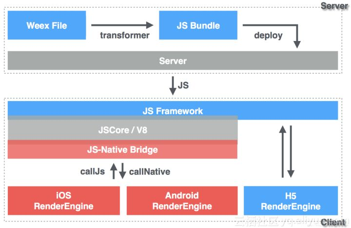
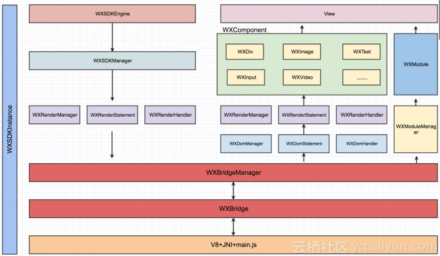

# WEEX

#### WEEX是什么

   Weex运用跨平台Web语言构建跨平台应用

   Weex主要包括三大部分：JS Bridge、Render、Dom，分别对应WXBridgeManager、WXRenderManager、WXDomManager 通过WXSDKManager统一管理。

     WXBridgeManager: JS和Native之间传递指令

     WXDomManager: 管理DOM树
     
     WXRenderManager: 渲染引擎
   
   其中JS Bridge和Dom运行在独立的HandlerThread中，而Render运行在UI线程。JS Bridge主要用来和 JS 端实现进行双向通信，比如把js端的dom结构传递给Dom线程。Dom主要是用于负责dom的解析、映射、添加等等的操作，最后通知UI线程更新。而Render负责在UI线程中对dom实现渲染。

   WEEX依旧采取传统的web开发技术栈进行开发，同时app在终端的运行体验不输native app。其同时解决了开发效率、发版速度以及用户体验三个核心问题。早期H5和Hybrid方案的核心是利用终端的内置浏览器（webview）功能，通过开发web应用满足跨平台需求。该方案可以解决跨平台问题，同时可以提升发版效率。但其最大的弊端在于用户体验相较于native开发的app存在较大差距，经常出现页面卡顿，加载慢等问题。

   以WEEX为代表云原生开发框架开始出现。所谓云原生(Cloud Native)指可以通过云端快速发布（与远程web应用发布流程类似），同时还可以达到媲美原生App体验的方案


#### WEEX框架

   WEEX框架主要分为两部分：

   * 前端JavaScript框架 
   * Native SDK

   

    从上图中可以看到weex的大致工作流程：

    1. 研发人员利用web技术栈开发weex file，打包成JS Bundle，然后部署到服务器上 
    
    2. 终端通过网络获取JS Bundle，然后在本地执行该JS Bundle

    3. 终端上提供了JS的执行引擎(JSCore)用于执行远程加载到JS Bundle

    4. JS执行引擎执行JS Bundle，并将相关渲染指令以及其他需要利用native能力的指令通过JS-Native Bridge透出

    5. JS-Native Bridge将渲染指令分发到native（Andorid、iOS）渲染引擎，由native渲染引擎完成最终的页面渲染

   ------

   
   
   如上图所示，WEEX NATIVE SDK大致可以分为如下几个层级：

   JS执行层：

    JS执行引擎：JSCore，解释并执行JS Bundle 
    
    main.js：提供WEEX runtime，SDK初始化，JS Core会首先加载main.js,为js bundle提供weex runtime 
    
    Bridge层：提供JS和Native的双向通信能力 
    
    Dom层：维护页面Dom结构 
    
    Render层：完成页面渲染 
    
    native组件库：本地UI组件库，每一个组件对应一个html标签，所以当我们在weex开发过程中使用到的各种标签：div、text、image等等，最终都被转化成为了一个native的控件 
    
    module manager、module库：功能模块管理层 
    
    WXSDKManger、WXSDKEngine：SDK全局环境维护 
    
    WXSDKInstance：weex 实例，一个js bundle对应一个weex实例

    
   #### WEEXSDK

   **WEEX初始化**

   * 完成初始化配置: 比如制定相关适配器，图片请求适配器等

   * 注册自定义的UI组件和功能模块

   
   **WEEXSDK初始化**

   * 初始化WXBridge，同时启动WXBridge线程，待接收指令。WXBridge在Android的实现本质上是一个基于HandlerThread的异步任务处理线程

   * initSo：加载so文件，即JS执行引擎

   * initScriptsFramework：加载SDK中的main.js,完成weex runtime的初始化

   * register：注册SDK自带的UI组件和功能模块


   **WEEX实例创建**

   * 实际上当WEEX SDK获取到JS Bundle后，第一时间并不是立马渲染页面，而是先创建WEEX的实例

   * 所有的js bundle都是放入到同一个JS执行引擎中执行，那么当js执行引擎通过WXBridge将相关渲染指令传出的时候，需要通过instance id才能知道该指令要传递给哪个weex实例

   * 在创建实例完成后，接下来才是真正将js bundle交给js执行引擎执行

   
   **页面渲染**

   * js bundle涉及dom操作的执行都会被weex-vue-framework转化成native dom api, 前端框架vue是基于virtual dom api,而weex的前端框架:weex-vue-framework的核心逻辑就是将vue的virtual-dom转换成Native DOM API 

   * weex终端的执行引擎在执行到Native DOM API后，则会将其转化为Platform API,说白了就是通过WXBridge将Native DOM API以约定的方式转发给native渲染引擎，完成页面渲染


   #### 总结

   WEEX放弃了传统的Webview，而是搭建了一个native化的浏览器，因为用native的方式实现了一个浏览器的大部分核心组成成分：

                     浏览器（chrome为例）      WEEXSDK

    JS 执行引擎  -----       V8              V8/JScore

    渲染引擎     -----      webkit           WXBridge + native渲染 

    DOM 树管理   -----     DOMTree           WXDomManager
    
    网络请求,持久层存储等等能力                 WEEXSDK配置调用native模块
    …

   另外为了保证整个SDK的运行效率，SDK维护了三个线程：

    bridge线程：完成js到native之间的通信 
    dom线程：完成dom结构的构建 
    渲染线程：完成UI渲染，也就是UI线程

    #### 个人感悟

    1. WEEXSDK本质是实现了一个浏览器不过渲染进程和网络进程，持久层进程都是调用native，而且利用native语言多线程特性，将JS线程，DOM线程，渲染线程并行执行

    2. 

   * 原生的渲染方式：view->layout->renderNode ->合成->GPU渲染
     
     webview目前渲染方式：html->dom tree ->render tree ->render layer + 栅格化 ->合成->gpu渲染。

   * 路由切换。web端路由切换体验也无法和原生相比。原生端可以轻松做到在路由切换的动画过程中完成下个页面的渲染，只有很小的帧率损失，web开发就只能干瞪眼了。
       
   * 手势交互。web端细粒度的手势检测已经不是问题，问题是通过手势检测带来的像素级动画会极大的降低帧率。原生开发则完全没有问题。


#### Vue与WEEX语法区别

   * WEEX只支持像素值，不支持相对单位(em,rem)

   * WEEX使用图片标签最好是```<image>```并且设定width和height行内样式, 类选择器在某些系统中不识别

   * WEEX默认div为flex布局，但是方向为column, 可以设定一个基类调整方向

   * WEEX布局中不识别百分比(%),只识别具体的值, vue-loader使用postcss-plugin-px2rem插件可以转为rem(默认75px = 1rem)

   * 只有text，input，richtext文本类组件支持color，font-size，text-align等样式，容器类的基本不支持

   * WEEX不支持background简写，background-color  background-image要写全
       
       
