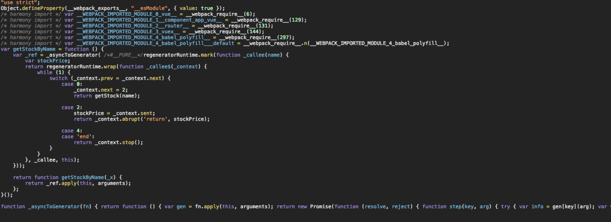
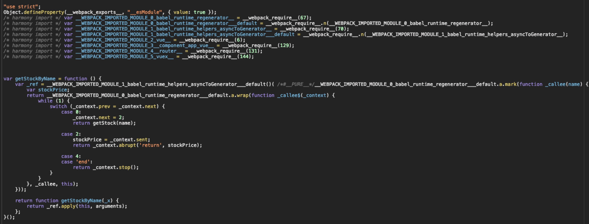

# babel基础

### babel简介

#### babel是什么，为什么还要配置插件？
   
   babel是一个Javascript编辑器，babel将运行代码分为3个阶段：解析，转换和生成，Babel并没有做任何事情，因此当我们不配置任何插件时，经过 babel 的代码和输入是相同的。
   
   Babel拥有众多模块可用于不同形式的静态分析

   > 静态分析是在不需要执行代码的前提下对代码进行分析的处理过程 （执行代码的同时进行代码分析即是动态分析）。 静态分析的目的是多种多样的， 它可用于语法检查，编译，代码高亮，代码转换，优化，压缩等等场景。
   
   Babel插件才会影响第二阶段：转换 这也是为什么babel需要配置插件的原因：
   
   1. babel的存在不只是为了「使用es的所有特性」，ES标准制定  TC39 将提案分为以下几个阶段:

    Stage 0 - 稻草人: 只是一个想法，可能是 babel 插件。

    Stage 1 - 提案: 初步尝试。

    Stage 2 - 初稿: 完成初步规范。

    Stage 3 - 候选: 完成规范和浏览器初步实现。

    Stage 4 - 完成: 将被添加到下一年度发布。

   Stage 1/2 的特性，完全有可能被改动甚至是撤销提案。因此从 babel 的角度来说，显然不能够默认启用这些特性，而需要有可配置的选项让用户自行衡量风险，决定是否使用。

   2. 针对不同平台，需要减少无用特性的编译以提高编译效率，所以需要不同平台使用不同插件，这就决定了可配置性的必要性

#### babel实现的原理是什么？

   babel实现源码的转换过程，每一步都涉及到创建或是操作抽象语法树(AST)
   
   具体实现过程请见一下链接 [https://github.com/jamiebuilds/babel-handbook/blob/master/translations/zh-Hans/plugin-handbook.md](https://github.com/jamiebuilds/babel-handbook/blob/master/translations/zh-Hans/plugin-handbook.md)

#### babel preset和plugins的区别？

   1. **preset是一组插件的集合**，比如 es2015 是一套规范，包含大概十几二十个转译插件。如果每次要开发者一个个添加并安装，配置文件很长不说，npm install 的时间也会很长

   2. 执行顺序:

* Plugin 会运行在 Preset 之前。

* Plugin 会从前到后顺序执行。

* Preset 的顺序则 刚好相反(从后向前)

   
   3. 插件和preset的配置项


   ```

   "presets": [
    // 带了配置项，自己变成数组
    [
        // 第一个元素依然是名字
        "env",
        // 第二个元素是对象，列出配置项
        {
          "module": false
        }
    ],

    // 不带配置项，直接列出名字
    "stage-2"
   ]

   ```

#### babel-preset-env

env 的核心目的是通过配置得知目标环境的特点，然后只做必要的转换。如果不写任何配置项，env 等价于 latest，也等价于 es2015 + es2016 + es2017 三个相加(不包含 stage-x 中的插件)
如果需要stae-x需要单独再配到presets里面

babel-preset-env 包含了当前所有的ES特性，但是建议不要直接配置“env”，可以配置目标浏览器或者node，只引进对应的polyfill和转换器，提高效率

```
{
  "presets": [
    ["env", {
      "targets": {
        // 配置将考虑所有浏览器的最新2个版本(safari大于等于7.0的版本)的特性，将必要的代码进行转换。而这些版本已有的功能就不进行转化了。
        "browsers": [ "last 2 versions", "safari >= 7"]
        // node版本
        "node": "node版本号" | "current"|true(表示运行babel)
      }
    }]
  ]
}

```

#### babel的兼容性？

   由于 Babel 假定您的代码将在 ES5 环境中运行，它使用 ES5 功能。所以如果你使用的是一个有限制的或者不支持 ES5 的环境例如较低版本的 IE, 那么使用 babel-polyfill 将会增加对这些方法的支持。它会仿效一个完整的 ES2015+ 环境，并意图运行于一个应用中而不是一个库/工具。

   用于 Babel 只转换语法(如箭头函数), 可以使用babel-polyfill支持新的全局变量(如Promise),新的原生方法等


#### 常用babel-*介绍

1. **babel-cli**

   顾名思义，cli 就是命令行工具。安装了 babel-cli 就能够在命令行中使用 babel 命令来编译文件。

2. **babel-node**

   babel-node 是 babel-cli 的一部分，它不需要单独安装，它的作用是在 node 环境中，直接运行 es2015 的代码，而不需要额外进行转码，babel-node = babel-polyfill + babel-register

3. **babel-register**

   babel-register 模块改写 require 命令，为它加上一个钩子。此后，每当使用 require 加载 .js、.jsx、.es 和 .es6 后缀名的文件，就会先用 babel 进行转码。

   使用时，必须首先加载 require('babel-register')。需要注意的是，babel-register 只会对 require 命令加载的文件转码，而 不会对当前文件转码。另外，由于它是实时转码，所以 只适合在开发环境使用。

4. **babel-core**

   babel-core 相当于是编程的方式去使用 babel，是把代码以字符串的形式从文件或者网络请求等读入，调用它的 transform 方法，转化为新的字符串，再写回文件或者网络返回

5. **babel-polyfill**

   babel 默认只转换 js 语法，而不转换新的 API，比如 Iterator、Generator、Set、Maps、Proxy、Reflect、Symbol、Promise 等全局对象，以及一些定义在全局对象上的方法(比如 Object.assign)都不会转码。

   使用时，在所有代码运行之前增加 require('babel-polyfill')。或者更常规的操作是在 webpack.config.js 中将 babel-polyfill 作为第一个 entry。因此必须把 babel-polyfill 作为 dependencies 而不是 devDependencies

   babel-polyfill 主要有两个缺点：

   1. 使用 babel-polyfill 会导致打出来的包非常大，因为 babel-polyfill 是一个整体，把所有方法都加到原型链上。比如我们只使用了 Array.from，但它把 Object.defineProperty 也给加上了，这就是一种浪费了。这个问题可以通过单独使用 core-js 的某个类库来解决，core-js 都是分开的。

   2. babel-polyfill 会污染全局变量，给很多类的原型链上都作了修改，如果我们开发的也是一个类库供其他开发者使用，这种情况就会变得非常不可控。
   
   因此在实际使用中，如果我们无法忍受这两个缺点(尤其是第二个)，通常我们会倾向于使用 babel-plugin-transform-runtime。

   但如果代码中包含高版本 js 中类型的实例方法 (例如 [1,2,3].includes(1))，这还是要使用 polyfill。

6. **babel-runtime 和 babel-plugin-transform-runtime (重点)**

   我们时常在项目中看到 .babelrc 中使用 babel-plugin-transform-runtime，而 package.json 中的 dependencies (注意不是 devDependencies) 又包含了 babel-runtime，那这两个是不是成套使用的呢？他们又起什么作用呢？

   先说 babel-plugin-transform-runtime。

   babel 会转换 js 语法，之前已经提过了。以 async/await 举例，如果不使用这个 plugin (即默认情况)，转换后的代码大概是：
    
   

    不用过于纠结具体的语法，只需看到，这个 _asyncToGenerator 在当前文件被定义，然后被使用了，以替换源代码的 await。但每个被转化的文件都会插入一段 _asyncToGenerator 这就导致重复和浪费了。

    在使用了 babel-plugin-transform-runtime 了之后，转化后的代码会变成

   

   从定义方法改成引用，那重复定义就变成了重复引用，就不存在代码重复的问题了。

   但在这里，我们也发现 babel-runtime 出场了，它就是这些方法的集合处，也因此，在使用 babel-plugin-transform-runtime 的时候必须把 babel-runtime 当做依赖。

   再说 babel-runtime，它内部集成了

   core-js: 转换一些内置类 (Promise, Symbols等等) 和静态方法 (Array.from 等)。绝大部分转换是这里做的。自动引入。
   
   regenerator: 作为 core-js 的拾遗补漏，主要是 generator/yield 和 async/await 两组的支持。当代码中有使用 generators/async 时自动引入。
   
   helpers, 如上面的 asyncToGenerator 就是其中之一，其他还有如 jsx, classCallCheck 等等，可以查看 babel-helpers。在代码中有内置的 helpers 使用时(如上面的第一段代码)移除定义，并插入引用(于是就变成了第二段代码)。
   babel-plugin-transform-runtime 不支持 实例方法 (例如 [1,2,3].includes(1))

   此外补充一点，把 helpers 抽离并统一起来，避免重复代码的工作还有一个 plugin 也能做，叫做 babel-plugin-external-helpers。但因为我们使用的 transform-runtime 已经包含了这个功能，因此不必重复使用。